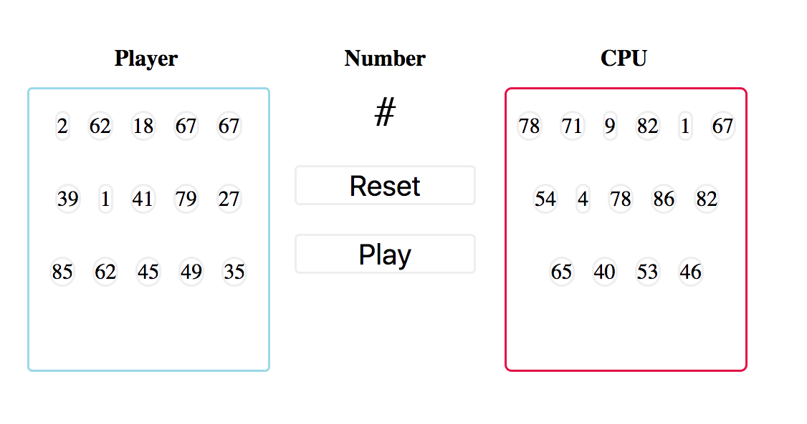

# Experiments - using JS + CSS from scratch

| Experiment        | Github                                    | Live example                            |
| -------------     |-------------                              |:-------------:                          |
| Musicplayer       | 🎵 [Musicplayer](experiments/Musicplayer) | https://codepen.io/AlberErre/pen/KexJra |
| Bingo             | 🎉 [Bingo](experiments/Bingo)             | https://codepen.io/AlberErre/pen/yEGjep |
| Interactive Piano | 🎹 [Piano](experiments/Piano)             | https://codepen.io/AlberErre/pen/NzEOWO |
| Launching Dice    | 🎲 [Dice](experiments/Dice)               | https://codepen.io/AlberErre/pen/NzBLQW |
| Console           | 🕹️ [Console](experiments/Console)         |                                         |

---------- 

### 🎵 Musicplayer:

---------- 

### 🎉 Bingo code:
 

---------- 

### 🎹 Piano code:

---------- 

### 🎲 Dice code:

---------- 

### 🕹️ Console experiments:
`3 < 2 < 1` returns `true`

A more detailed explanation is available [here!](experiments/Console/console-experiments.js)

