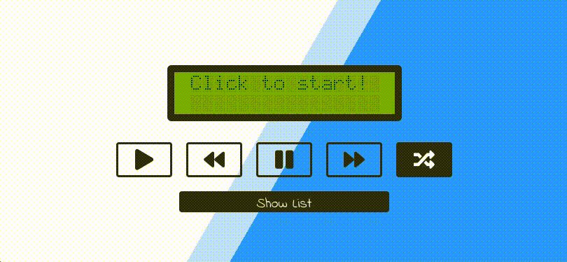
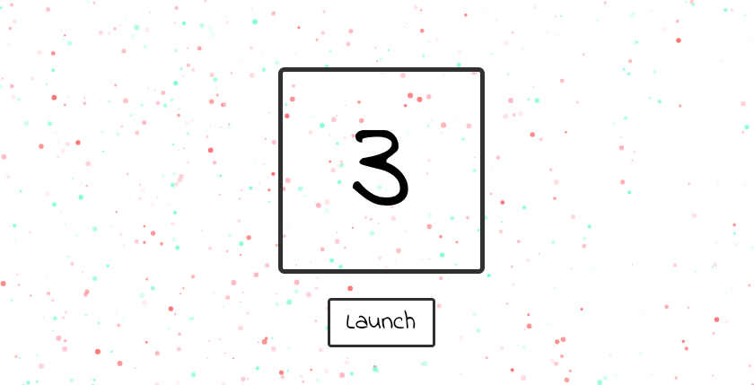

# Experiments - using React, vanilla JS and Firebase 🔥

| Experiment       | Github | Live example  | React | Firebase |
| -------------    |------------- |------------- |------------- |---------- |
| Space Piano | 🎹👾 [Piano](https://github.com/AlberErre/piano-react-hooks)| http://albererre.com/piano-react-hooks/ | ✅| ✖️ 
| To Do App | 📝 [ToDo](https://github.com/AlberErre/To-Do-App)             | https://albererre.com/experiments/todoapp/ | ✅| ✅ 
| Chatty Chat | 💬 [Chat](https://github.com/AlberErre/ChattyChat-firebase-redux)             | https://albererre.com/experiments/chattychat/ | ✅| ✅ 
| Love certificates | 💍 [Love](https://github.com/AlberErre/marriage-certificates-react)             | https://ether-marriage.com/ | ✅| ✖️ 
| Wave Counter (React Native) | 🏖️[Wave](https://github.com/AlberErre/waveCounter-redux) | https://github.com/AlberErre/waveCounter-redux  | ✅| ✖️| 
| Bingo             | 🎉 [Bingo](experiments/Bingo)             | https://albererre.com/experiments/bingo  | ✖️| ✖️ 
| Musicplayer       | 🎵 [Musicplayer](experiments/Musicplayer) | https://albererre.com/experiments/music  | ✖️| ✖️ 
| Launching Dice    | 🎲 [Dice](experiments/Dice)               | https://albererre.com/experiments/dice   | ✖️| ✖️ 
| Console           | 🕹️ [Console](experiments/Console)         |                                          | ✖️| ✖️ 

---------- 

### 🎹👾 Space Invader Piano Live example:

---------- 

### 📝 React ToDo App Live example:

---------- 

### 💬 Chatty chat Live example:

---------- 

### 💍 Love certificates Live example:

---------- 

### 🏖️ Wave Counter App (React Native):

---------- 

### 🎉 Bingo Live example:

---------- 

### 🎵 Musicplayer Live example:

---------- 

### 🎲 Dice Live example:

---------- 

### 🕹️ Console example:
`3 < 2 < 1` returns `true`

A more detailed explanation is available [here!](experiments/Console/console-experiments.js)

